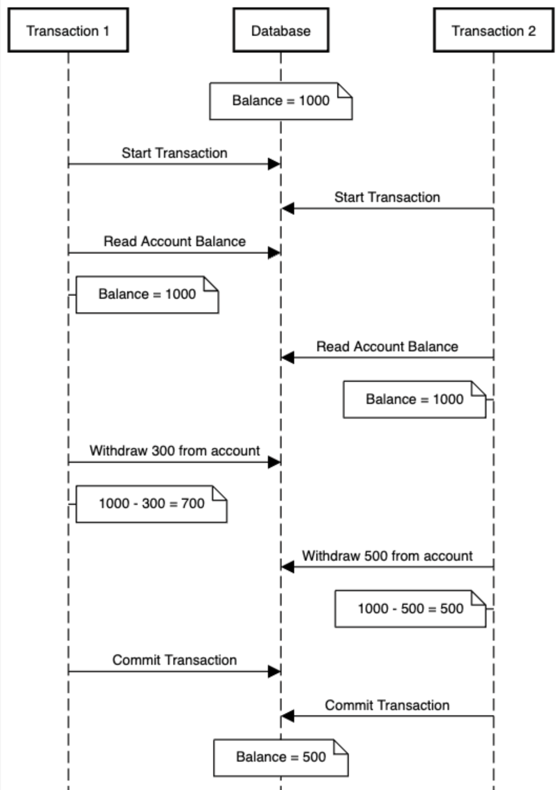
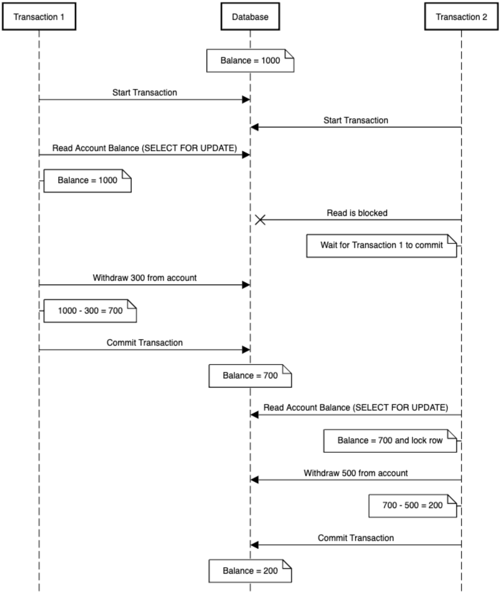

## Introduction

In modern software architectures, stateless services responsible for business logic are a common design choice. This works great for a wide variety of applications and plays nicely with containerization and horizontal scaling. However, there are some complexities that this may bring along with it — one of the most subtle and dangerous is concurrency. 

Concurrency issues can easily be overlooked because they are often edge cases at a certain scale. But if concurrency handling is not addressed early, they can result in data loss and many lost hours of debugging strange inconsistencies.

One strategy to address this sort of problem is at the database layer. I will cover one such approach by using PostgreSQL's row-level locking feature — specifically the `SELECT ... FOR UPDATE` statement. Taking the time to understand these sorts of problems and having a strategy in place will surely save you and your team trouble down the road.

## Background

Let's start with some quick background on locking in databases. This term may not be familiar to you if you haven't worked closely with how your database behaves under the hood, but I assure you, you have encountered locking before. For instance, take a standard update statement
```
UPDATE users SET name = 'Nick' WHERE id = 1;
```
This operation does a few things behind the scenes: it locates the data from the target row, locks it, and then updates that value. The row-level lock is put on the row to ensure no other transactions can modify the row until the current one finishes. This operation usually happens so fast that we don't think about the lock — but it is absolutely there.

Locking behavior is governed through something called the isolation level. This specifies how transactions interact with another transaction's data. By default PostgreSQL (and most other databases) have an isolation level of `READ COMMITTED`. This means that the only data that can be read is data that has been committed, where uncommitted data  (aka *dirty reads*) are not visible. Some databases (like SQL Server) allow `READ UNCOMMITTED`, which permits dirty reads. PostgreSQL, however, does not truly support this level and you should in general avoid tampering with this.

We won’t go deeper into isolation levels here, but it’s worth understanding this context before diving into row-level locking. Now, back to the problem at hand!

## The Problem

Let's use a simple example of having an account that users can withdraw money from.  You would probably have an endpoint in your service layer to withdraw from the account, which might have some SQL statements that look like this:

```
-- Start a transaction
BEGIN;

-- Read the current account balance
SELECT balance
FROM accounts
WHERE id = '1';

-- Perform some validation...

-- Update the account balance
UPDATE accounts SET balance = balance - 300 WHERE id = '1';

-- Commit the transaction
COMMIT;
```

Simple right? But what happens when two transactions perform this operation at the same time? 

If there were two concurrent transactions, the account balance could be calculated incorrectly if there were two concurrent transactions created to withdraw from the account based on a race condition between the two transactions.

Let's say the account starts with a balance of `1000`. Transaction 1 and Transaction 2 both begin and read the current balance — both see `1000`. Transaction 1 subtracts `300` and commits. Then Transaction 2 subtracts `500` and commits.

Now the final balance is `500`, but **a total of 800 was withdrawn**. Something’s clearly wrong. This is a classic race condition caused by a lack of concurrency control at the database level.

This problem is illustrated by the below ladder diagram.




## Solving Concurrency with Row-Level Locking

In order to be able to ensure that the balance stays accurate, row-level locking can be used to ensure the data cannot be edited. At a high level, what we want to do is tell the database, "hey, database, I'm going to edit this row, make sure nothing happens to it while I work on it". This can be done with a locking method in a database like PostgreSQL with a `SELECT ... FOR UPDATE` command. This command will put a lock on the row until the transaction in which it is included either commits or rolls back, so in turn can serialize these sorts of updates coming into the database.

The set of commands to execute this would not look any different, except the initial read through the `SELECT` clause would have `FOR UPDATE` added to the end.

```
-- Start a transaction
BEGIN;

-- Read the current account balance
SELECT balance FROM accounts WHERE id = '1' FOR UPDATE;

-- Perform some validation...

-- Update the account balance
UPDATE accounts SET balance = balance - 300 WHERE id = '1';

-- Commit the transaction
COMMIT;
```
Now, if two transactions try to withdraw from the same account:

- Transaction 1 acquires the lock.
- Transaction 2 is **blocked** until Transaction 1 commits or rolls back.
- Transaction 2 then reads the updated balance and proceeds correctly.



Now, with this simple measure, we can ensure that the account balance stays accurate — even during concurrent transactions. YAY!

## Performance Considerations

While this approach solves concurrency issues, it can also bring along an increase in request latency. Since each transaction that accesses the same row must wait for the previous one to complete, these operations become serialized, essentially forming a queue. This ensures data integrity but can slow things down under heavy load.

In many cases, the tradeoff is worth it: consistency is more important than raw speed. However, if low latency is critical to your application, you may want to explore asynchronous, event-driven architectures instead. These systems allow you to decouple processing from user-facing requests, helping reduce perceived latency while still preserving correctness in eventual consistency models.

## Is This the Right Approach for You?

Row-level locking is a powerful tool, but I do want to add that it may not be suitable for all applications.

The case for adding this will depend on your business case. In a financial application like in the above example, accuracy is a must. Think bank accounts, ticket sales, and inventory control. In these cases strict concurrency control is crucial.

But in other situations, perfect accuracy isn’t worth the complexity or performance tradeoff. For example counting views or likes on a post or maybe tracking analytics events. In these cases it may be acceptable for the number to be slightly off due to concurrency.

The key is to understand your product requirements so you can make an informed decision and define your approach.
## Look Out for Deadlocks!

While row-level locking prevents race conditions, it can introduce deadlocks if not used carefully. In the example above, we do not run the risk of a deadlock because there is a single account being worked on in each transaction. 

Deadlocks occur when two (or more) transactions wait on each other for data in a circular fashion.

Transaction 1
```
SELECT balance FROM accounts WHERE id = '1' FOR UPDATE;
-- later
SELECT balance FROM accounts WHERE id = '2' FOR UPDATE;
```
Transaction 2
```
SELECT balance FROM accounts WHERE id = '2' FOR UPDATE;
-- later
SELECT balance FROM accounts WHERE id = '1' FOR UPDATE;
```

Both transactions are now waiting for the other to commit or roll back — Deadlock!

PostgreSQL will recognize this issue and abort one of the transactions. In general, you should avoid this pattern and keep a consistent order when acquiring locks to avoid this altogether.
## Conclusion

Concurrency can be sneaky and should be handled early on during application development. Fortunately, with features like `SELECT ... FOR UPDATE`, PostgreSQL gives us the tools we need to handle concurrency safely. By applying these patterns early, you can save yourself a lot of debugging time and ensure your system scales with integrity.

If you want to go further in your learning of this topic, check out some of the other features PostgreSQL has to offer, including table and page-level locks. You can read more about them in the documentation here: [13.3 - Explicit Locking](https://www.postgresql.org/docs/current/explicit-locking.html#EXPLICIT-LOCKING).

I hope you enjoyed this article. Please leave a comment if I missed anything or if you have used row-level locking in your projects!

Thanks for reading :)